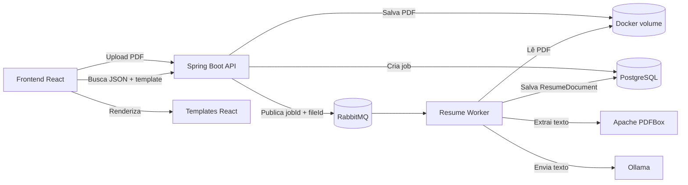

# Resume2Portifolio

Resume2Portifolio transforma um currículo em PDF em um portfólio web navegável. O projeto recebe o arquivo, extrai seu texto, usa um modelo local para estruturar as informações em JSON e renderiza esse JSON em um dos templates React disponíveis.

> Projeto local-first: o processamento de IA roda com Ollama dentro do Docker Compose e não exige uma API key externa.

## O que o projeto faz

- Recebe currículos em PDF.
- Salva os arquivos em um volume Docker persistente.
- Extrai texto real usando Apache PDFBox.
- Processa o texto de forma assíncrona com RabbitMQ.
- Estrutura os dados usando Ollama ou um provider fake para testes.
- Salva o documento estruturado como JSONB no PostgreSQL.
- Permite escolher entre os templates `Editorial` e `Minimal`.
- Renderiza o portfólio no frontend com React.
- Persiste jobs entre recarregamentos da página.
- Permite excluir o job, seus eventos e o PDF salvo.

## Arquitetura



O sistema usa apenas um worker de processamento. Depois que o worker salva o `ResumeDocument` e marca o job como `READY`, o frontend busca o JSON e escolhe o template. Não existe um worker separado para gerar HTML ou ZIP.

### Fluxo de processamento

1. O frontend envia o PDF e o template escolhido.
2. A API valida tamanho e template.
3. O PDF é salvo em `/app/data/uploads/{fileId}.pdf`.
4. O job é criado no PostgreSQL.
5. Uma mensagem com `jobId` e `fileId` é publicada em `resume.process`.
6. O `resume-worker` lê o PDF e extrai o texto com PDFBox.
7. O texto é validado e enviado ao provider de IA configurado.
8. O resultado é convertido em `ResumeDocument` e salvo como JSONB.
9. O job passa para `READY`.
10. O frontend busca `{ portfolioName, template, data }` e renderiza o portfólio.

## Stack

### Backend

- Java 21
- Spring Boot 3.4
- Spring Web
- Spring JDBC
- Spring AMQP
- PostgreSQL 16
- RabbitMQ 3.13
- Apache PDFBox 3.0.3
- Ollama

### Frontend

- React
- TypeScript
- Vite
- Nginx para servir o bundle em produção

### Infraestrutura

- Docker Compose
- Volumes persistentes para PostgreSQL, RabbitMQ, PDFs e modelos Ollama

## Como executar

### Pré-requisitos

- Docker Desktop com Docker Compose.
- Pelo menos alguns GB livres para o modelo Ollama.
- macOS, Linux ou Windows com Docker funcionando.

### Subir o projeto

Na raiz do projeto:

```bash
docker compose up -d --build
```

Na primeira execução, o Compose baixa o modelo configurado. O download pode demorar e o serviço `ollama-init` termina com `Exited (0)` depois de concluir essa tarefa; isso é esperado.

Acesse:

- Frontend: http://localhost:3000
- API: http://localhost:8080
- RabbitMQ Management: http://localhost:15672
- Ollama: http://localhost:11434

Credenciais padrão do RabbitMQ:

```text
usuário: guest
senha: guest
```

### Verificar os serviços

```bash
docker compose ps
curl http://localhost:8080/actuator/health
curl http://localhost:11434/api/tags
```

### Ver os logs

```bash
docker compose logs -f api resume-worker
```

## Configuração

As variáveis podem ser definidas em um arquivo `.env` na raiz ou diretamente no ambiente.

| Variável | Padrão | Descrição |
| --- | --- | --- |
| `RESUME_AI_PROVIDER` | `ollama` | Provider da IA: `ollama` ou `fake` |
| `RESUME_AI_MODEL` | `qwen2.5:3b` | Modelo usado pelo Ollama |
| `RESUME_AI_BASE_URL` | `http://ollama:11434` | URL do serviço Ollama dentro do Compose |
| `RESUME_WORKERS` | `1` | Número de consumidores do processamento de currículo |
| `RESUME_MOCK_STEP_DELAY_MS` | `1000` | Atraso demonstrativo entre etapas |
| `RESUME_MAX_FILE_SIZE_BYTES` | `10485760` | Tamanho máximo do PDF em bytes |
| `RESUME_MIN_TEXT_LENGTH` | `80` | Tamanho mínimo do texto extraído |
| `RESUME_MAX_TEXT_LENGTH` | `100000` | Tamanho máximo do texto extraído |

Para executar sem IA real, use o provider fake:

```bash
RESUME_AI_PROVIDER=fake docker compose up -d --build
```

O provider fake não interpreta o PDF. Ele retorna um documento fixo para validar o restante do fluxo.

## API principal

### Criar um job

```http
POST /api/resumes
Content-Type: multipart/form-data
```

Campos:

- `file`: PDF do currículo.
- `template`: `editorial` ou `minimal`.

Exemplo:

```bash
curl -X POST http://localhost:8080/api/resumes \
  -F 'file=@./curriculo.pdf' \
  -F 'template=minimal'
```

Resposta:

```json
{
  "jobId": "uuid"
}
```

### Listar jobs

```http
GET /api/resumes/
```

### Consultar um job

```http
GET /api/resumes/{jobId}
```

### Buscar dados do portfólio

Disponível quando o job estiver em `READY`:

```http
GET /api/resumes/{jobId}/portfolio
```

Resposta:

```json
{
  "portfolioName": "Nome da pessoa",
  "template": "minimal",
  "data": {
    "schemaVersion": "1.0",
    "basics": {},
    "summary": "...",
    "experience": [],
    "education": [],
    "skills": [],
    "languages": [],
    "projects": []
  }
}
```

### Excluir um job

```http
DELETE /api/resumes/{jobId}
```

A exclusão remove o PDF do volume, os eventos relacionados e o job do PostgreSQL. Jobs excluídos durante o processamento são ignorados por mensagens atrasadas do worker.

## Templates

Os templates ficam no frontend:

```text
frontend/src/templates/portfolio/
├── EditorialTemplate.tsx
└── MinimalTemplate.tsx
```

Eles recebem o `ResumeDocument` como propriedade e são renderizados pela rota:

```text
/portfolio/{jobId}
```

As seções são condicionais: campos ou coleções vazias não geram títulos ou espaços vazios no portfólio.

## Persistência

Volumes Docker usados pelo projeto:

| Volume | Uso |
| --- | --- |
| `resume2portifolio_postgres-data` | Jobs e documentos estruturados |
| `resume2portifolio_rabbitmq-data` | Dados do RabbitMQ |
| `resume2portifolio_app-data` | PDFs enviados |
| `resume2portifolio_ollama-data` | Modelos Ollama |

Os PDFs ficam dentro dos containers em:

```text
/app/data/uploads/{fileId}.pdf
```

Listar PDFs salvos:

```bash
docker exec resume2portifolio-api-1 ls -lh /app/data/uploads
```

## Desenvolvimento local

### Backend

```bash
cd backend
mvn test
```

### Frontend

```bash
cd frontend
npm install
npm run dev
```

Para validar o frontend:

```bash
npm run build
npx tsc --noEmit
```

## Decisões técnicas

### Processamento assíncrono

O upload responde rapidamente com um `jobId`. A extração e a inferência podem demorar, especialmente com modelos locais executando via Docker, por isso o processamento ocorre em RabbitMQ e o frontend acompanha o status por polling.

### Separação entre dados e apresentação

O backend não gera HTML. Ele persiste e entrega o documento estruturado. Os templates são componentes React no frontend, o que permite alterar o visual sem alterar o pipeline de extração ou a API de IA.

### Provider de IA substituível

`ResumeAIExtractor` abstrai o provider. O projeto possui uma implementação real para Ollama e uma implementação fake determinística para testes e desenvolvimento sem modelo.

### Persistência explícita

O PDF, o job, os eventos e o JSON estruturado possuem responsabilidades separadas. Isso permite acompanhar o processamento, recarregar a tela sem perder jobs e excluir os artefatos de forma controlada.

## Limitações atuais

- PDFs escaneados sem camada de texto não passam por OCR.
- A qualidade do JSON depende do modelo Ollama escolhido.
- O portfólio é renderizado no frontend e ainda não é exportado como ZIP.
- O sistema ainda não possui autenticação ou usuários.
- O banco usa inicialização SQL simples para o protótipo; migrations formais podem ser adicionadas em uma etapa futura.

## Licença

Este projeto ainda não possui uma licença definida. Escolha uma licença antes de publicar o repositório como projeto open source.
